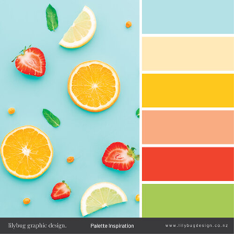

# Season

<bold>Seasons</bold> is the path into your healthy lifestyle. A site that cares for the well being of the user and the planet. It is no secret a healthy diet leads to a healthy and enjoyable lifestyle. Seasonal eating is not just good for us and the planet but it is also a delicious way of approaching a better life. When produce is in the season it at its natural and its ripest. All of our produce is sourced within the UK and is picked, packed and shipped when it is ripe. None of our produce is frozen to be eaten later all  food delivered to the consumer 
is picked and packed within the week you order it.

You can order a box for the month you decide to order or you can subscribe to the season which you choose. I f you sign up to the winter months you will receive all the freshest fruit and vegetables
for the months in winter.

## Table of Contents
1. [**UX**](#ux)
- [**Target Audiences**](#target-audience)
- [**User Stories**](#user-stories)
- 2. [Design](#design)
- [Fonts](#fonts)
- [Colours](#colours)
- [Logo](#logo)
- [Wireframe](#wireframe)

2. [**Features**](#features)
- [**Existing Features**](#existing-features)
- [**Features Left to Implement**](#features-left-to-implement)
3. [**Information Architecture**](#information-architecture)
- [**Database Choice**](#database-choice)
- [**Data Modelling**](#data-modelling)

4. [**Technologies Used**](#technologies-used)
- [**Languages**](#languages)
- [**Libraries and Frameworks**](#libraries-and-frameworks)
- [**Tools**](#tools)
- [**Databases**](#databases)

5. [**Testing**](#testing)
6. [**Deployment**](#deployment)
- [**Local Deployment**](#local-deployment)
- [**Heroku Deployment**](#heroku-deployment)

7. [**Credits**](#credits)
- [**Code**](#code)
- [**Content and Media**](#content-and-media)
- [**Acknowledgements**](#acknowledgements)
8. [**Disclaimer**](#disclaimer)

## User Experience (UX)
## Target Audience

- People who want to lead a healthier lifestyle but do not have time to shop for fresh produce.
- People who do not have the time to go shopping for fresh produce.
- People who don't know what to buy when they go shopping for fresh produce.
- People who don't know what is in season within the UK.
- People who want fresh produce and not frozen produce.
- People who want to eat fruit and vegetables but don't want it to be flown in from other countries.

## User Stories  
### First Time Visitor Goals
1. As a First Time Visitor, I want to easily navigate the app using the navbar.
2. As a First Time Visitor, I want to be able to easily find and look through the different products the shop has to offer without the obligation of registering an account.
3. As a First Time Visitor, I want to be able to navigate to different parts of the site and view the information that it has to offer.
4. As a First Time Visitor, I want to be able to place products into my cart and browse the other items.
5. As a First Time Visitor, I want to be able to place numerous products in my basket as well as multiple amounts of products.
6. As a First Time Visitor, I want to be able to navigate to different parts of the site and view the information that it has to offer.
7. As a First Time Visitor, I want to be able to safely securely purchase my items from the checkout.
8. As a First Time Visitor, I want to be able to use the search engine to find different products I might want to buy.

### Returning Visitor Goals
1. As a Returning Visitor, I want to be able to register an account with the site.
2. As a Returning Visitor, I want the site to be able to remember my delivery details.
3. As a Returning Visitor, I want to be able to look through the subscriptions and learn if it is better value to subscribe.
4. As a Returning Visitor, I want to be able to look through the subscriptions and learn what produce is in season in particular times of the year.

### Frequent User Goals
1. As a Frequent User, I want to be able to log in easily to the app with my login details.
2. As a Frequent User, I want to be able to edit and or delete my delivery details.
3. As a Frequent User, I want to be able to view the past orders I have made on the site.
4. As a Frequent User, I want to be able to easily and safely exit the app.
5. As a Frequent User, I want to be able to view the app easily on different devices.
6. As a Frequent User, I want to receive an email confirmation after checkout, so that I can make sure that payment was successful.

### Site Owner Goals Goals
1. As a site owner I want to be able to edit, delete and add products and or change the subscriptions.
2. As a site owner I want to receive emails from the users when they fill out the contact form so that I can reply to them satisfying users queries.

[TESTING](https://github.com/jimbobding/seasons/blob/master/TESTING.md)

## Design
### Colour Scheme

As an e-commerce store I wanted the focus to be on the products and images, so when choosing the colour scheme I wanted it to be clam and not overpowering. I wanted the colours
to fit in the aesthetic of the site, as the site is based around seasonality I wanted the colours to match this. The original inspiration for the colour scheme was warm tropical bright colours that make people feel almost as if they are on holiday, a way to bring out happiness
whilst searching through online sites. I wanted to utilize the fantastic colour that fresh fruit and vegetables can give off, ranging from bright tropical colours to low key earthy tones that do well to complement their surrounding elements.

### Fonts 
#### MainFont
- [Raleway](https://fonts.google.com/specimen/Raleway) I used this as my main font as it clean and stylish. As a font I find it is easy to read.

#### Main Colours Used 
##### Black 
I tried many colours for the nave bar and footer, but I ended up always going back to black. I found it not only had a stylish clean look to it but it complimented all of the hero images I was using for pages of the site. I used this for my search bar as well to keep it uniformed.
##### Mustard

-  `rgb(224, 157, 55)`
Mustard worked very well at giving an Autumnal feel to the site, it is also not an invasive colour so it allows the pictures and elements around it to catch the eye.
##### Green 
-  `rgb(72, 153, 114, 0.75)`
The darker grass green colour was used for its calming effect and connotations to farming and fresh produce.

##### Salmon
-  `rgb(253, 89, 86, 0.5)`
I fell upon the salmon colour by chance, I was looking for a red colour to use but fond them to invasive> when I tested a salmon colour it worked well at not being overpowering but still adding a lively spark to the site.

##### Grey/Denim Blue
-  `rgba(192, 204, 216, 0.75)`
The grey denim blue was used initially to complement the green. It also has a rustic washed farm look and again gives a nice presence without taking centre stage.

### Logo
The logo was used in the nav-bar as a route back to the home page. The logo itself is a love heart made out of frut and vegetables with the sites tag line beside it.
[Canva](https://www.canva.com/) to design the logo.

### wireframes
#### Frameworks
- [Bootstrap](https://getbootstrap.com/), front-end framework is chosen for this project for its modern interface, ease of use and ability to be easily customized. It is used for creating features such as navbar, cards, forms, modals, as well as for the layout.
- [JQuery](https://jquery.com/) is used for initializing some Bootstrap components, as well as for custom functions, DOM manipulation.

#### Wireframes
For my wireframes I first used pen and paper to jot down my original thoughts and then once I had a clearer picture in my head of
how I wanted the app to look I used [Balsamiq](https://balsamiq.com/) to mock it up. The design did change from the pen and pad to Balsamiq
to actual coding as certain things did not look at good as I hoped, but overall it stayed pretty much the same.

 [wireframes](https://github.com/jimbobding/seasons/blob/master/media/wireframes/wireframe)

## Features
### Existing features

#### Navbar
The navbar is fixed at the top of the page all the time, this allows a user to easily navigate throughout the website.
The logo is located in the top left corner on a desktop and in the centre on the smaller devices. 
The logo redirects users to the index/home page when clicked on. On smaller resolutions (tablet, mobile) 
the navbar is collapsed into a burger icon. Menu links appear when the burger icon is clicked and collapses back when clicked again.    

Navbar also contains a search box, where a user can search for a product.  
Also, navbar contains a cart icon along with a grand total displayed if there are items in the cart added. The navbar contains a profile instruction which when clicked drops down into, Either log in or register if the user is not signed in or it shows log out and order history if the user is logged in. If the user is logged in as admin it allows the user to use the product admin and takes the user to the add a product page.

#### Landing (home) page
- 
The landing page serves to attract new users to the business, to give a clear understanding of what the company does and to attract users to use the website's functionality (subscribe/buy boxes). 
- **Hero image** section contains a full-screen image, main heading with a subheading and 2 buttons "Book tea ceremony" and "Buy tea or teaware" that redirect a user to the services and products pages, correspondingly. The purpose of this section is to attract new users, to make the first impression and to call to action.
- **Introduction about** section contains a summary of the company and its purpose. It also contains a CTA to which takes the user to the bout page which holds more information.
- **Boxes**  section contains a heading and image of a box of vegetables along with some information about the food boxes we supply and  CTA to the shop where users can buy the products. This is to give users an outline of what the company sells.
- **Subscriptions** section has a brief about how the company supplies boxes containing produce dependent on seasonality and how users can sign up for particular seasons. This section has an image of red fruit on a white background and a CTA to the subscriptions page.
- **Register** section contains a heading informing the user to register to the site above a circular picture of a happy customer in a farm environment using an I-pad the image was used to display the merge of technology and farming to make the connection of ordering fresh produce over the internet. This section also contains a CTA to the register page.

#### About page
- 
The about page is used to tell the customer about how the company works through its tag line "from farm to box to you"
- **Hero image** The hero image of the about page is a long shot of a farm and mountains.  
- **Icons** A selection of 3 icons to about the tagline "from farm to box to you" wit a farm, box and person icon each having a sentence under each icon.
- **Farm** section tells the user about the farming aspect about the company, where we source our produce, with a picture of people farming. 
- **Box** section tells the user about the process of how the company curates the boxes before we send them to the user. This section has an image of someone preparing produce.
- **You** section contains a summary of how the companies boxes are tailored to the user. This section contains a picture of a man on a farm staring at the camera.

#### Products
- 
The Product page is used to display all the products that the site has to offer and allows the user to add the product to their shopping cart.
- **Hero image** The hero image of the products page is a colourful array of fresh fruit and vegetables.
- **Query filter** Above the displayed products there is a drop-down query filter that will separate the products into 4 categories. Fruit boxes, Veg boxes, fruit and veg boxes and subscriptions.
- **Product cards** The product cards are displayed in rows of three on large screens rows of two on medium screens and single items on small devices.
An image will take up roughly half of the card on the top half whilst the bottom half will contain the name of the product, the price of the product, the price per box of the product as well as edit and delete buttons that can only be used by the site admin.
- **Product detail** The image on the product cards are a href that will take the user to the product detail page, which will display the same information on the face of the card as well as ass description of the product. On the product detail, page the user can add the product to their cart if the add to cart button is clicked
the product will be added in increments of one allowing the user to easily add products to the cart. They are also able to use the increment buttons to increase and decrease the amount of the product the would like to add each time.
There is also edit delete buttons that are only available for admin.

#### Subscriptions page
- 
The subscription page is used to show the seasonal subscriptions the site offers
- **Hero image** The hero image of the subscription page is of berries on a tree.
- **Seasons** The body of the subscription page is taken up four sections each representing one of the four seasons of the year. Each section has a picture that represents the season and a description of the seasons in terms of the produce it has to offer and a CTA with the name of the season it which takes the user to the season detail page.
- **Season detail** The image from the season section is used a the hero image for the season detail page. So if a user clicks spring they will be taken to the spring page with the spring picture as the hero image, the name of the season and the months that fall into that season will be displayed over the top of the image. In the body of the subscription page, 
there are details of how the subscription works. Which is fresh produce from the season will be picked as it is ripe and fresh and sent in weekly boxes to the user the boxes will different every week as it will be fresh produce that is in season that particular month. Within the body, all the fruits and vegetable that come into season throughout the three months
will be displayed. At the bottom of the page, there will be three cards showing the prices for the different subscription sizes.

#### Profile page
- 
The profile page can only be used if the user is logged in.
- **Delivery Information** The user's default delivery information is displayed here as well as an option to edit the information, by typing the new information into the text fields and clicking the update information button.
- **Order History** On the profile page there is a link to the order history page which takes the user to a page containing all their past orders. It contains a table with a list of the order number, date, the products purchased and the total amount it cost. There is also a CTA taking the user back to the profile page.
- **User info**  There is a card on the profile page displaying the user's username and email address. The card also has two buttons that allow the user to buttons one that allows the user to change their password the other allows them to manage their email addresses.

#### Cart Page
--**Items Display** Displays the purchases in the cart at that moment, with the price and subtotal. It also has the decrementer so you can increase or decrease the number of items in your cart.
--**Buttons**  Has two buttons, one for a secure checkout and one to keep shopping which is linked back to the product page.

##### Checkout Page
--**Items Display** Displays the purchases in the cart along with a summary of how many items the user has in the cart and the total price including delivery cost.
--**Checkout form** Has a form for the user to fill in to gather name address email etc. As shown in my model's section of  [**Data Modelling**](#data-modelling). The user can add these details or if they are an existing user they will be preloaded and the user can edit them for this delivery but will have to go into the user profile to permanently change the details. The form also has a payment section where the user would enter there payment details including - Card number expiry date and CCV number.
the amount that will ve charged to the account will be displayed next to the box where the card number os input so the user is sure on how much they are spending.
--**Buttons**  Has two buttons, one for a secure checkout and one which will take the user back to the cart in case they want to make any last-minute adjustments.

##### Checkout Success
--**Order Information** Once the user has input all their information into the checkout form and proceeded with the payment they will be taken to the check out success page (if payment is verified)> here they will see a pa card with their delivery information including the details and the items purchased as well as an order number.
--**Success Toast** The user will also receive an email with the order information on, and this will be made known to them by a toast that will pop in up I the corner when they have completed the order. As well as in a line of text that will be displayed above te order information.

## Features to Implement

--**Extend the product model**  I would like to extend the offering off the site to gie a lot  more variation in products still focusing around seasonality. I would like to add more thinkgs like health shakes and smothies, were users woul dbe sent hte recipes an d ingriedients to make at hier own leisure.
--**Tailored boxes** I would like to add a section where the boxes are tailored specifically yot teh use I could be a build your own box with whatever is in season.
--**Form** I would like to add a forum that wouold allow users to connect wuth each other and swap recipes news. This would also allow te store owner to connect with users and share usful information as well collectioning information on what users of the store would like to see. 

## Technologies used

### Languages

- [HTML](https://developer.mozilla.org/en-US/docs/Web/HTML)
- [CSS](https://developer.mozilla.org/en-US/docs/Web/CSS)
- [JavaScript](https://www.javascript.com/)
- [Python](https://www.python.org/) - Python is a general-purpose coding language. th elanguage I used to construct this site.
- [Jinja](https://jinja.palletsprojects.com/en/2.11.x/) - templating language for Python, to display back-end data in HTML.

Tools

### Libraries and Frameworks
- [Django](https://www.djangoproject.com/) - Python framework for building the project.

- [pip](https://pip.pypa.io/en/stable/installing/) For installing tools used in the project
- [HTML5](https://en.wikipedia.org/wiki/HTML5) Used to build my project
- [Cascading-Style-Sheets](https://www.w3.org/Style/CSS/Overview.en.html) Used to style my project
- [Am-I-Responsive](http://ami.responsivedesign.is/) I used this to check the responsiveness on devices and used the images as part of the read me file
- [Google-Fonts](https://fonts.google.com/) Used for the two types of text used throughout the project 
- [Font-awesome 5](https://fontawesome.com/) Used for icons used on the project 
- [Jquery](https://jquery.com/download/) Jquery used to simplify some of the code
- [Bootstrap4](https://getbootstrap.com/) Used for the  framework of my project and also for the navigation bar, the cards (spirit selection, cocktail cards)
- [Python-3.8.2] (https://www.python.org/) Back end programming language dI used for this project.
- [Gunicorn](https://gunicorn.org/) - a Python WSGI HTTP Server to enable deployment to Heroku.
- [Stripe](https://stripe.com/) - to handle financial transactions.
- [Django-Crispy-Forms](https://django-crispy-forms.readthedocs.io/en/latest/) - to style Django forms.
- [Coverage]() - to see the percentage of automated testing.

# Tools

- [Jinja](https://jinja.palletsprojects.com/en/2.11.x/) - templating language for Python, to display back-end data in HTML.
- [Heroku](https://dashboard.heroku.com/app) - to host the project.
- [git-hub](https://github.com/) To Store my code.
- [git](https://git-scm.com/) For version control.
- [git-pod](https://www.gitpod.io/) Used as my IDE to work on my code.
- [PIP](https://pip.pypa.io/en/stable/installing/) - for installation of necessary tools.
- [Balsamiq](https://balsamiq.com/) - to create wireframes.

# Databases
- [SQlite3](https://www.sqlite.org/index.html) - a development database.
- [PostgreSQL](https://www.postgresql.org/) - a production database.

### Heroku deployment

1. Login to my Heroku account.
2. Click on New at the right top corner and click on Create new app (app name must be unique).
3. Choose App name and a region (Europe was the closest to me). Then click on Create app.
4. Go to the terminal window and create requirements.txt by running command `pip3 freeze --local > requirements.txt.` This will contain teh dependencies for the site.
5. Then create Procfile by running command echo web: python app.py > Procfile Remember P is capital
6. Add these files to the staging area by running command `git add requirements.txt & git add Procfile`.
7. Then commit these file respectively by running command `git commit -m "Added requirements.txt &  Added Procfile."`
8. Then push these files to GitHub by running command `git push`
Go to resources tab in Heroku, then in the  search bar look for Heorku Postgres(you can type `postgres`), select Hobby Dev — Free and click Provision button to add it to your project.     
6. In Heroku Settings click on Reveal Config Vars - set config vars as follows.   

| KEY            | VALUE         |
|----------------|---------------|
| AWS_ACCESS_KEY_ID | `<your aws access key>`  |
| AWS_SECRET_ACCESS_KEY | `<your aws secret access key>`  |
| DATABASE_URL| `<your postgres database url>`  |
| EMAIL_HOST_PASS | `<your email password(generated by Gmail)>` |
| EMAIL_HOST_USER| `<your email address>`  |
| SECRET_KEY | `<your secret key>`  |
| STRIPE_PUBLIC_KEY| `<your stripe public key>`  |
| STRIPE_SECRET_KEY| `<your stripe secret key>`  |
| STRIPE_WH_SECRET| `<your stripe wh key>`  |
| USE_AWS | `True`  |

8. Copy DATABASE_URL's value(Postrgres database URL) from the Convig Vars and temporary paste it into the default database in settings.py.     
You can temporary comment out the current database settings code and just paste the following in the settings.py:  

- DATABASES = {
'default':dj_database_url.parse('< your postgres >')
}

Migrate the database models to the Postgres database using the following commands in the terminal:    
`python3 manage.py makemigrations`     
`python3 manage.py migrate`

11. Create a superuser for the Postgres database by running the following command
`python3 manage.py createsuperuser` . You will be given instructions to type a username you want to yse along with a password into the terminal
12. Remove your Postgres URL database from the settings and uncomment the default DATABASE settings code in the settings.py file.  
13. Add  Heroku app URL to ALLOWED_HOSTS in the settings.py file.
14. Connect Heroku to GitHub to automatically deploy each time you push to GitHub.    

- Go to Deployment Method and click on Github Connect to Github.
- Then make sure your Github Profile is displayed and add your repository name and click on Search.
- Once it finds your repository click on Connect.
- No when you push to github yor code will also push to Heroku.
If you do not want to use automatic deploy you can do it manaully from  the terminal by following the commands ont websit [Heroku](https://dashboard.heroku.com/apps/seasons-farm-box-you/deploy/heroku-git)

15. After the app has deployed successfully you can view by clicking open app on te heroku platform.
16. You will also need to verify your email address, so you need to login with your superuser credentials and verify your email address in the admin panel. Now you will be able to view the app running.   

##### Hosting media files with AWS
The **static files** and **media files** (that will be uploaded by superuser - product/subscription images) are hosted in the [AWS S3 Bucket](https://aws.amazon.com/). To host them, you need to create an account in AWS and create your S3 basket with *public access*. More about setting it up you can read in [Amazon S3 documentation](https://docs.aws.amazon.com/AmazonS3/latest/gsg/CreatingABucket.html) and [this tutorial](https://django-storages.readthedocs.io/en/latest/backends/amazon-S3.html).
##### Senging email via Gmail
In order to send real emails from the application, you need to connect it to your Gmail account, setting up your email address in EMAIL_HOST_USER variable and your app password generated by your email provider in EMAIL_HOST_PASS variable.

<b><a href="#table-of-contents">↥ Back To Top</a></b>

## Information Architecture
### Database choice
During the development phase I worked with sqlite3 database which is installed with Django.   
For deployment(production), a PostgreSQL database is provided by Heroku as an add-on.
- The User model used in this project is provided by Django as a part of defaults `django.contrib.auth.models`. 

### Data Modelling
#### Profile App
##### UserProfile
| **Name** | **Database Key** | **Field Type** | **Validation** |
--- | --- | --- | --- 
User | user | OneToOneField 'User' |  on_delete=models.CASCADE
Full Name | profile_full_name | CharField | max_length=70, null=True, blank=True
Phone number | profile_phone_number | CharField | max_length=20, null=True, blank=True
Address Line1 | profile_address_line1 | CharField | max_length=60, null=True, blank=True
Address Line2 | profile_address_line2 | CharField | max_length=60, null=True, blank=True
Town/City | profile_town_or_city | CharField | max_length=50, null=True, blank=True
County | profile_county | CharField | max_length=50, null=True, blank=True
Postcode | profile_postcode | CharField | max_length=20, null=True, blank=True
Country | profile_country | CountryField | blank_label='Country', null=True, blank=True

#### Products App
##### Product
| **Name** | **Database Key** | **Field Type** | **Validation** |
--- | --- | --- | --- 
Category | category | ForeignKey 'Category' | null=True, blank=True, on_delete=models.SET_NULL
Sku| sku | CharField | max_length=254 null=True, blank=True
Name | Name| CharField | max_length=254
Description | description | TextField  
Price per box | price per box | DecimalField | max_digits=6, decimal_places=2, null=True
Price | price | DecimalField |max_digits=6, decimal_places=2, null=True 
Rating | rating | DecimalField | max_digits=2, decimal_places=1, null=True, blank=True, validators=[MinValueValidator(0), MaxValueValidator(5)]
Image | image| ImageField | null=True, blank=True
Image Url | image_url | URLField | max_length=1024, null=True, blank=True
Is a subscription|is_a_subscription| BooleanField, default=False
season  |season  models.CharField(max_length=254, null=True, blank=True)

#### Checkout App
##### Order
| **Name** | **Database Key** | **Field Type** | **Validation** |
--- | --- | --- | --- 
Order Number | order_number | CharField | max_length=32, null=False, editable=False
Profile | profile | ForeignKey 'UserProfile' | on_delete=models.SET_NULL, null=True, blank=True, related_name='orders'
Full Name | full_name | CharField | max_length=50, null=False, blank=False
Email | email | EmailField | max_length=254, null=False, blank=False
Phone number | phone_number | CharField | max_length=20, null=False, blank=False
Town/City | town_or_city | CharField | max_length=50, null=False, blank=False
Street address1 | street_address1 | CharField | max_length=40, null=False, blank=False
Street address2 | street_address2 | CharField | max_length=80, null=False, blank=False
County | county | CharField | max_length=80, null=True, blank=True
Postcode | postcode | CharField | max_length=20, null=True, blank=True
Country | country | CountryField | blank_label='Country*', null=False, blank=False
Purchase Date | purchase_date | DateTimeField | auto_now_add=True
Delivery Cost | delivery_cost | DecimalField | max_digits=6, decimal_places=2, null=False, default=0
Order Total | order_total | DecimalField | max_digits=10, decimal_places=2, null=False, default=0
Grand Total | grand_total | DecimalField | max_digits=10, decimal_places=2, null=False, default=0
Original Cart | original_cart | TextField | null=False, blank=False, default=''
Stripe Pid | stripe_pid | CharField | max_length=254, null=False, blank=False, default=''

##### Order Line Item Details 
| **Name** | **Database Key** | **Field Type** | **Validation** |
--- | --- | --- | --- 
Order | order | ForeignKey 'Order' | null=False, blank=False, on_delete=models.CASCADE, related_name='lineitems'
Product | product | ForeignKey 'Product' | null=False, blank=False, on_delete=models.PROTECT
Quantity | quantity | IntegerField | null=False, blank=False, default=0
Line Item Total | lineitem_total | DecimalField | max_digits=6, decimal_places=2, null=False, blank=False, editable=False

##### Category
| **Name** | **Database Key** | **Field Type** | **Validation** |
--- | --- | --- | --- 
Name | name | CharField | max_length=254
Friendly Name | friendly_name | CharField | max_length=254, null=True, blank=True

#### Subscriptions App
##### Subscriptions
| **Name** | **Database Key** | **Field Type** | **Validation** |
--- | --- | --- | --- 
Season | season | CharField | max_length=254, null=True, blank=True
Name | Name| CharField | max_length=254
Description | description | TextField  
Price | price | DecimalField | max_digits=6, decimal_places=2, null=True 
Price per box | price per box | DecimalField | max_digits=6, decimal_places=2, null=True
Months | months | TextField
Fruit | fruit | TextField
Vegetables | vegetables | TextField
Image | image| ImageField | null=True, blank=True
Image Url | image_url | URLField | max_length=1024, null=True, blank=True

##### Sizes

| **Name** | **Database Key** | **Field Type** | **Validation** |
--- | --- | --- | --- 
Name | Name| CharField | max_length=254
Price | price | DecimalField | max_digits=6, decimal_places=2, null=True 
Price per box | price per box | DecimalField | max_digits=6, decimal_places=2, null=True
Description | description | TextField  

## Credits 

### Code

- The functionality of the cart and uuser profule and format for the checkout pages ad product admin were all take n and modified for the code institute course,  Full stack webdevolpment in partiular the boutique ado ecomerce shop project.
- The code for the button underneath the hero title on the hero page was taken form.

- The navigation bar, cards, modal and mobile-first framework all from [Bootstrap]()
https://ibb.co/3k51S5K

### websites

All websites I used for reference and guidance.

- [stackoverflow](https://stackoverflow.com/)
- [w3schools](https://www.w3schools.com/)
- [csstricks](https://css-tricks.com/)

### Images
- [unsplash](unsplash.com/) - Used fo general images for the site.
- [Foodies Feed](https://www.foodiesfeed.com/) - Used for food images for the site.
- [abel and cole](https://www.abelandcole.co.uk/startmyshop) - Used for image and copy for the food boxes.

### Informtion
- [penny golightly](https://www.pennygolightly.com/british-seasonal-food-may/) -  used to find informaton on priduce seasonality.

### Special Thanks

- I would like to give a special mention to all the people on slack and all the people Code Institute, in particular, the Tutor support team and my Mentor Aaron Sinnot

**This project is for educational use only.**

